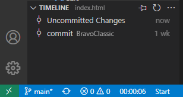
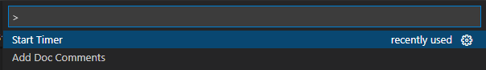

# Dev-Friend 

A VS-Code extension to track the time, lines of code while working in it. 

## Features

- It provides time tracking and captures line of code written.
- Provides notifications to trake break and get hydrated.
- A SideBar where user can view his previous days active time and lines of code written.

## Usage
- Hit `Ctrl + Shift + P`
- Type the command `Start Timer`
- You will see the timer and a pause button on the status bar.




## Contributing
Pull requests are welcome. For major changes, please open an issue first to discuss what you would like to change.

## Local Setup
- Fork the repository and clone it to your local.
- Run `npm install`.
- Open extension.js and Press `F5`.
- Select VS-Code development.

## Useful commands

Switch branches:
```
git checkout <branch-name>
```

Make new branch and switch to it:
```
git checkout -b <branch-name>
```

## Extension Settings


## License
[MIT](https://choosealicense.com/licenses/mit/)


